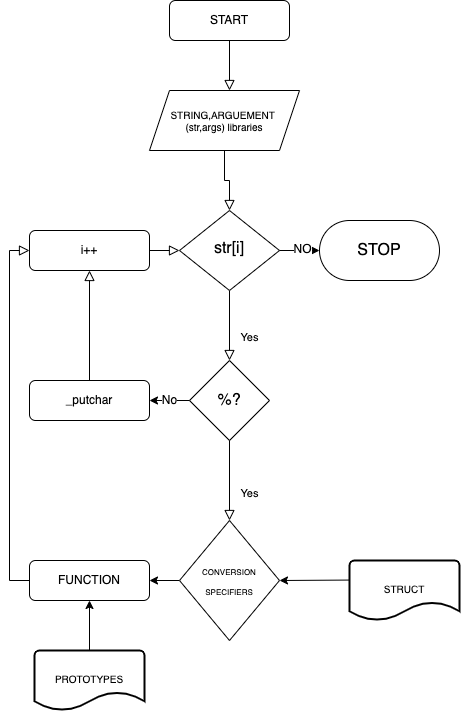

# printf

 In programming languages such as C, printf is a function that sends text, variables, or another object to the screen. If you're more familiar with the other programming languages, printf is equivalent to the print function. Below is an example of "Hello World!" getting print to the screen in C.

EXAMPLE CODE
include <stdio.h>

int main()
{ printf("Hello World!\n"); }

## What does the "f" in printf stand for?

The "f" in printf is short for "formatted" and indicates that the text printed to the screen will be formatted.
We used a principal function called _printf() for give the string or specifiers to other function called check_format. In this second function search which specifier is and and send it to other function that prints the correspondent argument.
For understand how it works we can use this flow chart.

## Usage

For useit you need all the files in the repository!
